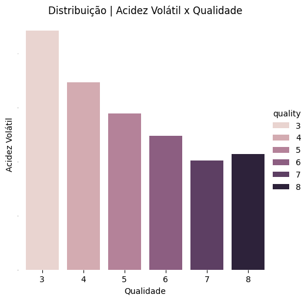
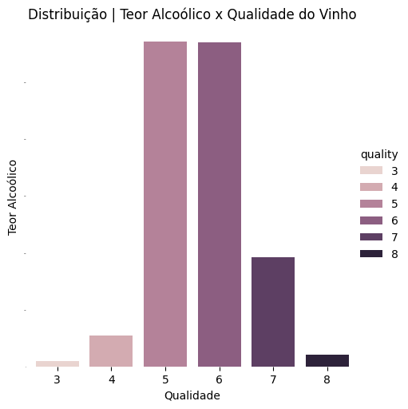
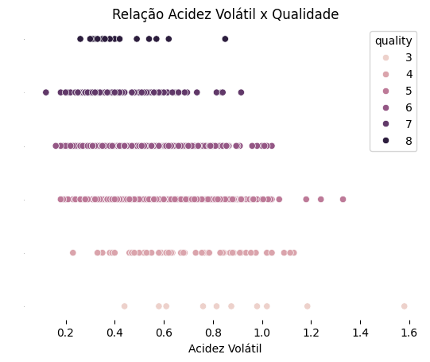
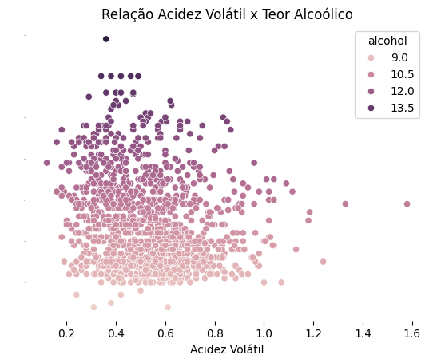
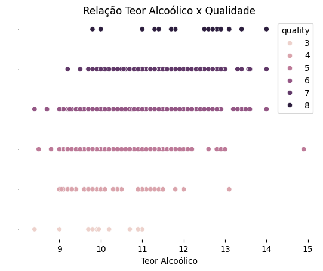

[🔃 (go-to 🇧🇷) Versão em Português](https://github.com/camimq/fiap_wine_data_viz/blob/main/README_pt-BR.md)

# 👩‍💻 DataViz Challenge 

> Individual activity of the Data Visualization discipline of the postgraduate course in Data Analytics at FIAP.

## Proposta

We will use part of the code made in the [first challenge](https://github.com/camimq/fiap_wine) to perform the tasks below:

### Bring the graphs made in the previous analysis but, this time, using the Seaborn library, improving the look of the graphs.

#### Distribution Charts
Set of frequency distribution graphs for the numeric variables in the dataset.

##### Distribution of Volatile Acidity x Wine Quality

##### Distribution of Alcoholic Content x Wine Quality

##### Relation | Acidity x Wine Quality

##### Relation Acidez x Teor Alcoólico

##### Relaçtion | Alcohol Content x Wine Quality

##

Made with ❤️ by Cami Queiroz 🎙 Let´s Talk!

  